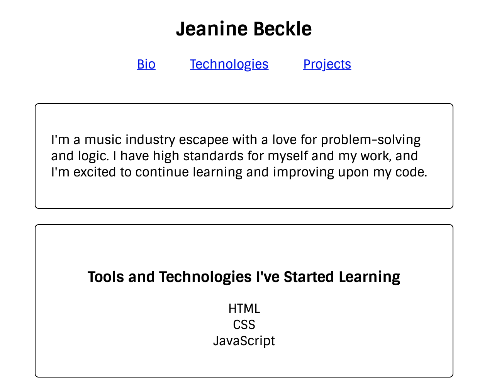
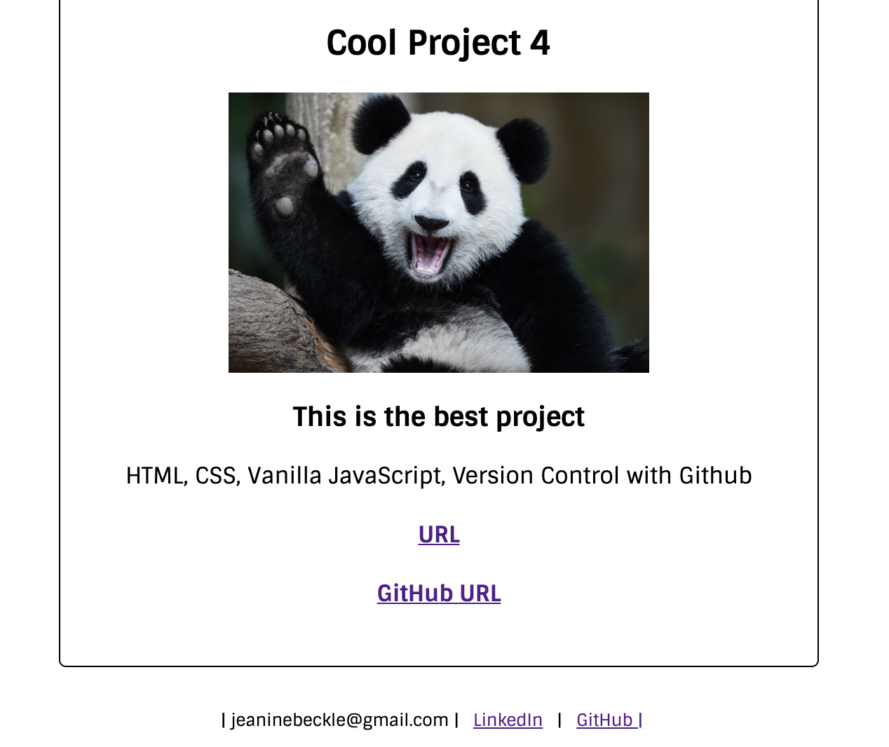

# Personal Bio Site

## Description
This is the start of a personal bio project that will be modified and improved upon over the course of 6 months. It will feature information about me and projects I have completed.

### Feature List
* Header with functioning links to other sections of the site
* "About Me" intro
* Featured projects (currently with dummy data including panda placeholder images because why not?)
* Very basic CSS styling including Google font
* Contact information

### How To Run
1. Clone the repo to have it on your local machine
1. Use `hs` to start up a local server
1. Visit the server in your browser (defaults to localhost:8080)

### Screenshots

### Contributors
* [Jeanine Beckle](https://github.com/jeaninebeckle)

### TODO
* This is a work in progress. Add real data when it exists.
* Improve styling because it looks really lame right now.
