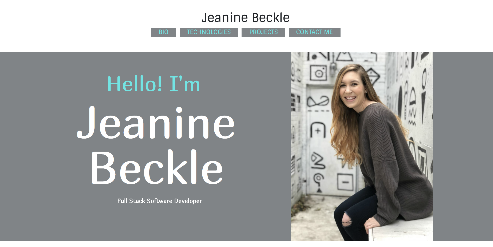
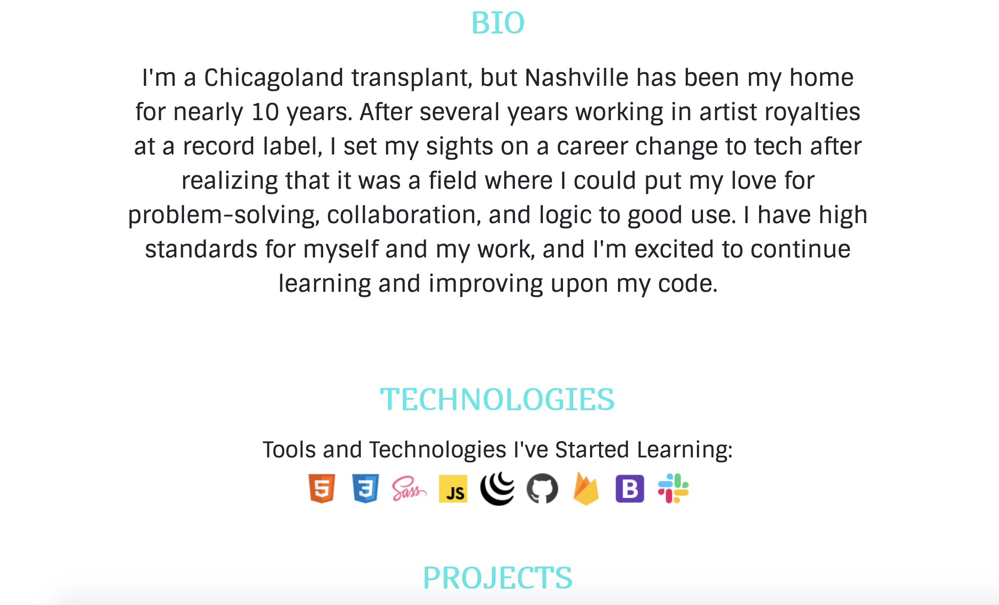
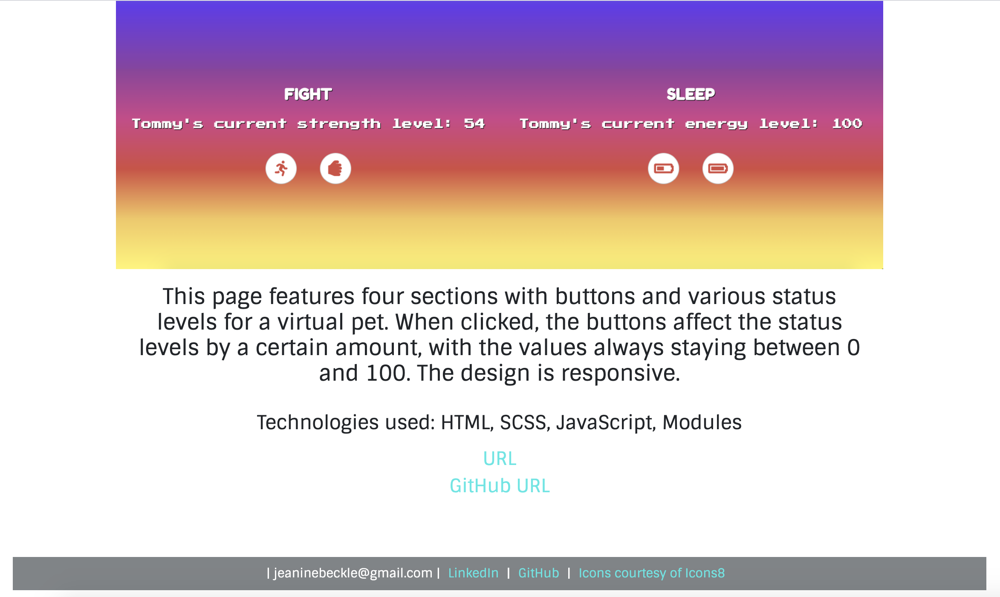

# Personal Bio Site

## Description
This is the start of a personal bio project that will be modified and improved upon over the course of 6 months. It will feature information about me and projects I have completed.

### Feature List
* Header with functioning links to other sections of the site
* Introduction banner with photo
* Sections for bio, technologies, and projects
* SASS/CSS styling including Google font
* Footer with contact information

### How To Run
1. Clone the repo to have it on your local machine along with all of the webpack components
1. Use `npm start` to start up a local server
1. Visit the server in your browser (should launch automatically and defaults to localhost:8080)

### Screenshots

### Contributors
* [Jeanine Beckle](https://github.com/jeaninebeckle)

### TODO
* This is a work in progress. Add more project data when it exists.
* Consider displaying projects in a more compact way
